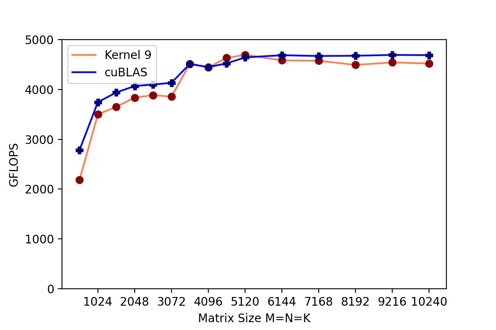

## Optimize SGEMM on Nvidia GPU

This repo contains several implementations of SGEMM on GPU. I tried different optimization techniques, such as iling, register blocking, prefetching, etc. The best implementation is `sgemm_header_file/kernel8.cuh`, and its result is shown below. 

## Test Environment
System: Ubuntu 20.04 under WSL2

Compiler: NVCC 10.1

GPU: GTX 1660 supper

Required compile flag: -lcublas

## Results

## Reference

1. https://github.com/jeonggunlee/CUDATeaching

2. https://github.com/yzhaiustc/Optimizing-SGEMM-on-NVIDIA-Turing-GPUs 

3. https://github.com/Liu-xiandong/How_to_optimize_in_GPU
